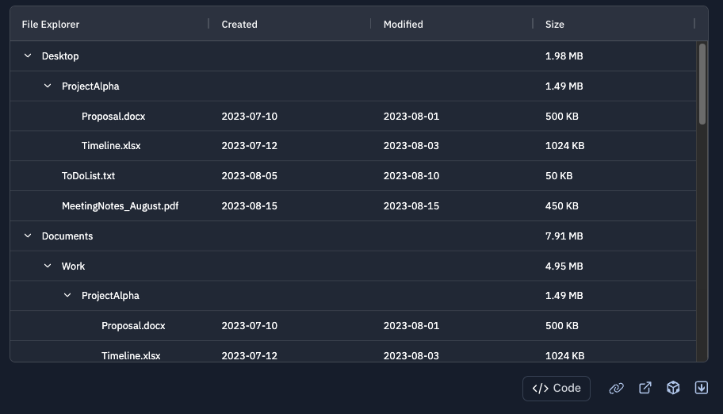
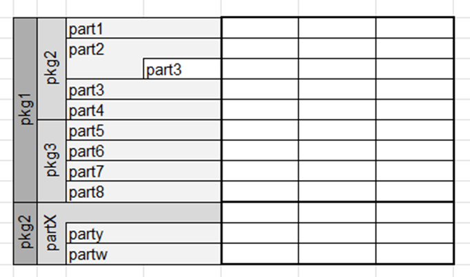
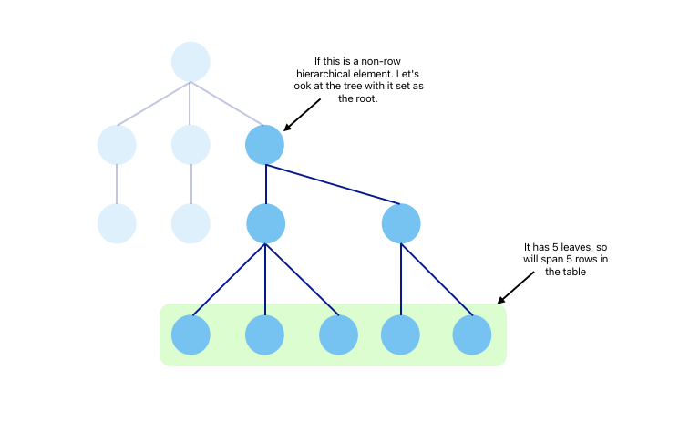
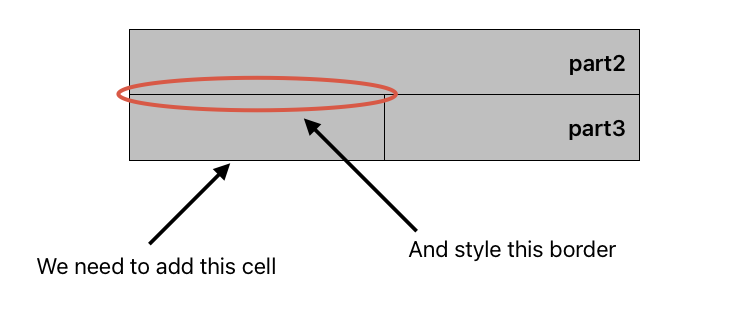
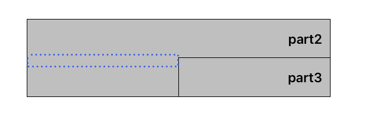
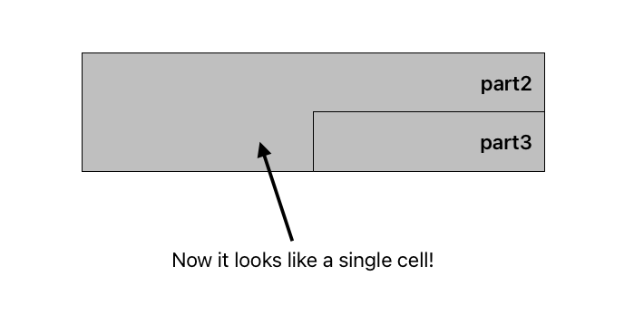
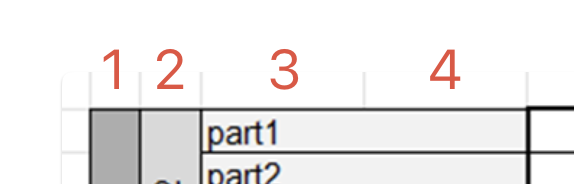
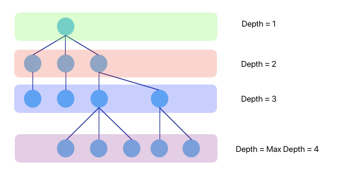
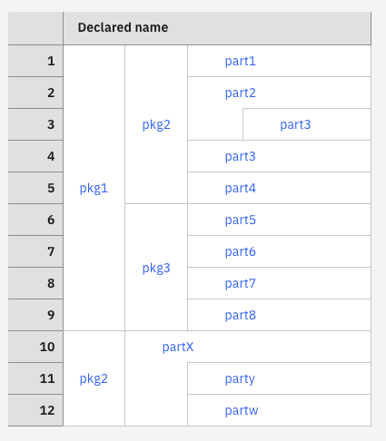

+++
date = '2025-12-02T17:00:33+01:00'
title = 'Hierarchy in tables'
summary = 'Creating a new hierarchical visual formatting in html tables.'
disableComments = true
+++

# Hierarchy in tables

## Table of contents

- [Introduction](#introduction)
- [The plan of action](#the-plan-of-action)
- [Data and its structure](#data-and-its-structure)
- [Rendering the table](#rendering-the-table)

## Introduction

Systems modelling is the discipline of using models to build out complex interconnected systems in domains ranging from IT to trains, planes and automobiles. These systems are broken down into simpler _elements_ which are connected through _relationships_ to simulate things like their functions and architecture. These elements are usually formatted into diagrams with boxes and connecting lines which makes visualising the relationships between them easy. You may have come across UML diagrams, these are an example of how complex systems can be visualised. But elements are not always simple - they can be modelled as children of other elements, they can be parents of other elements, they can subset other elements etc. Trying to visualise all of this in a diagram can be difficult, there would be connecting lines all over the place!

[Rhapsody Systems Engineering](https://www.ibm.com/products/rhapsody-systems-engineering) is a systems modelling tool from IBM that I worked on. It provided the ability to show element and their properties in structured table, but we faced the challenge of:

> ## How should the hierarchical information between elements be shown in the table?

I was tasked with creating a new visual formatting to be applied to the rows of html tables so that hierarchy between elements can be easily understood. Traditionally, this is displayed as a tree like structure within the rows of the tables (eg. [AG Grid tree data](https://www.ag-grid.com/react-data-grid/tree-data/)):



However in our scenario, some elements in the table needed to be displayed purely for hierarchy purposes and weren't actually relevant to the table data i.e. they would not be rows in the table themselves. If we went down the tree-structure route, many of the rows would be used just to display a hierarchical element which wastes vertical space.

This problem gets complex when you realise there are 3 types of situations that need to be dealt with:

1. Elements which are relevant to the table data and have no children. These should be displayed as rows in the table. I will refer to these are <span style="color:yellow">_row elements_</span>.
2. Elements that are purely for hierarchy and have children. These should not take up rows in the table. I will refer to these as <span style="color:orange">_non-row elements_</span>
3. Elements which are relevant to the table data but also have children. These should also be displayed as rows in the table. These are also considered <span style="color:yellow">_row elements_</span>

And to further complicate things, for situations 2 and 3 the children could be any of the three situations themselves! With this knowledge, an example of what a table with these requirements could look like was sketched:

<a id="h-table-example"></a>


In this table, elements that have children span across rows. If they are not relevant to the table data (<span style="color:orange">_non-row elements_</span>), they just span the rows of their children (`pkg1`, `pkg2`, `pkg3` etc.). If they are relevant to the table data (<span style="color:yellow">_row elements_</span>), they also get a row (`part2`, `partX`). This means a table only need as many rows as there are elements that are relevant to the table data and we don't have to expand a tree to understand the hierarchy of a given element, the information is all there at a glance. Perfect!

Making this in a spreadsheet is all fine and dandy but when we are dealing with dynamic data with any number of relevant elements, child elements and hierarchical elements, things get difficult. Furthermore, displaying this in a regular html table adds even more complexity since we don't have the convenience of being able to merge cells after drawing all the table cells.

Difficult, but not impossible.

## The plan of action

It's convenient now to think of the whole data structure as a tree. All leaf nodes are always <span style="color:yellow">_row elements_</span> and other nodes can represent <span style="color:yellow">_row elements_</span> or represent <span style="color:orange">_non-row elements_</span>.

### Situation 1 - Row elements with no children

These are easy. These are just rows in the table, no special treatment is really needed here. However, these could be children of other elements, we will deal with these along with the other, more special, elements next.

### Situation 2 - Non-row elements that always have children

These are also relatively easy. HTML tables allow for cells to span across multiple rows, with the [`rowspan`](https://developer.mozilla.org/en-US/docs/Web/API/HTMLTableCellElement/rowSpan) property, which means these elements in the table can be rendered as we want them natively.

<span style="color:orange">_Non-row elements_</span> in the table will need to span the number of rows equal to the number of leaves it has, given a tree with the element as the root. Leaf nodes are just <span style="color:yellow">_row elements_</span> that have no children.

Here's a visual example to try and highlight that last point:



So going back to our example above, `pkg1` has 9 leaves when it is the root node and `pkg3` has 4. In both cases, the cell spans exactly that number of rows. Determining the number of leaves for a given node is covered a little later on in the [Data and it's structure](#data-and-its-structure) section.

### Situation 3 - Row elements with children

This is a bit more difficult. For context, we are trying to tackle elements like `part2` and `partX` in our example above. There is no native HTML table way for a cell to both span across rows _and_ still be a row itself, it's one or the other.

To achieve this, we have to hack it a bit. We add empty cells before all the row cells of the element's children and style the border so that it all looked like the same cell. I will call this additional empty cell a `spacerCell` from now on. So if we have some `part3` that is a child of `part2` and `part2` is also a <span style="color:yellow">_row element_</span>, this is how a `spacerCell` would be added:



All the cells will have a border on the right and the bottom so setting the `border-top: none` on the `spacerCell` won't achieve the look we are going for. The bottom border for the cell above will still show up. Instead, We add a `::before` CSS element positioned at the top of the cell with an appropriate width and the same background colour as the cells to hide the borders and present it as one big cell.

```css
td.spacerCell::before {
  content: "";
  position: absolute;
  top: -2px;
  left: 0;
  right: 0;
  height: 4px;
  background-color: var(--cell-background-color);
  z-index: 1;
}
```





### All situations

#### Colspans

So that's all the row stuff sorted, but what about the columns? Similar to the `rowspan` property, there is a [`colspan`](https://developer.mozilla.org/en-US/docs/Web/API/HTMLTableCellElement/colSpan) property which will need setting too. In the hierarchy table sketch from earlier we can see that the rows actually span across 4 columns:



How did we get the value of 4? Well it's the maximum depth of the tree.

Depending on how deep into the hierarchy an element is, its cell in the table will need to span a different number of columns; for example `part1` spans only 2/4 columns.

Let's link it all back to the tree structure:

- The maximum number of columns any cell can span is the maximum depth of the tree (which happens when a row element has no children and no parents).
- Each element represented by an internal node will then span across the columns equal to the depth that the element is in the tree.
- Finally, a leaf node will span across the number of columns equal to the maximum depth minus it's depth (eg. `part1` will span 2 columns = max depth of 4 - its depth of 2).



## Data and its structure

To achieve the hierarchy format we want, we need to get some key bits of metadata about the elements in the table:

1. **Whether the element is a <span style="color:yellow">_row element_</span>**.
2. If the element is a <span style="color:orange">_non-row element_</span>, then **how many leaves it has**. Remember, leaves are just <span style="color:yellow">_row elements_</span> that have no children.
3. The number of ancestors an element has. In practice we can get this information from storing the **id of the parent of the element**.
4. Finally the **depth** of the element in the hierarchy tree.

The data for the table came from an API and was formatted as an array of elements with the following shape:

```ts
type DataFromApi: ElementHierarchy[];

type ElementHierarchy = {
    element: Element;
    isRowElement?: boolean;
    children?: ElementHierarchy[];
}
```

To make retrieving the data quick and efficient, a Map was generated to hold the data. The map has the following shape:

```ts
type HierarchyMap = Map<string, HierarchyMapData>;

type HierarchyMapData = {
  element: Element;
  isRowElement: boolean;
  depth: number;
  parentId?: string;
  numLeaves?: number;
};
```

Conveniently, the API flags whether an element is a <span style="color:yellow">_row element_</span> or not. But the other bits of information needs to be calculated. We do this by recursively traversing the element data and filling metadata information as we go. At a high level it looks like this:

```ts
const generateHierarchyMap = (root: ElementHierarchy): HierarchyMap => {
  let hierarchyMap: HierarchyMap = new Map();

  function traverse(node, depth, parentId) {
    // Initialise the leaves to the number of direct children this node has that are row elements.
    let numLeaves = node.children.filter((c) => c.isRowElement).length || 0;

    // If this node has children, recursively traverse them.
    // Add the number of leaves to the running total.
    if (node.children) {
      node.children.forEach((child) => {
        numLeaves += traverse(child, depth + 1, id);
      });
    }

    // Set the data in the hierarchyMap
    hierarchyMap.set(node.id, {
      element: node.element,
      isRowElement,
      ...(parentId && { parentId }), // <-- only set the parentId if it exists
      depth,
      ...(isRowElement === false && { numLeaves }), // <-- only set the number of leaves if this node is a non-row element
    });
  }

  root.children.forEach((child) => {
    traverse(child, 0);
  });

  return hierarchyMap;
};
```

Cool, that's all our metadata done! We now have a nice hierarchy map that we can use to render our table. Let's now use it to actually render the table.

## Rendering the table

To render the table we iterate through each row, generate a `<tr>` for it and then decide on what to render to the cell depending on what the column is. There are two types of columns in the table, the special column that shows the hierarchical structure of the elements and the regular columns that show the properties of the element in that row. The regular columns will just be a `<td>` with the value of the property.

The special column, however, is rendered by generating the right collection of sub-cells which come together to display the cell in the way we want. To do this we will recursively travel up the parent chain of each <span style="color:yellow">_row element_</span> and add in the appropriate sub-cells. We initialise an array with a base cell, `<td>` with the value of the property, this cell will have a `colSpan` set to the maximum depth minus the depth of the cell as mentioned in [Colspans](#colspans).

```tsx
<tbody>
    {rows.map((row) => (
        <tr>
            {row.cells.map((cell) => {
                if (cell is the special column) {
                    const HData = hierarchyMap.get(rowElement.elementId);
                    let cells = [<td colSpan={maxDepth - (HData?.depth ?? 0)}>{cell.name}</td>];
                    cellIds.push(rowElement.elementId);

                    // This is where we recurse up the parent chain, the cells array is passed as a reference
                    const spacerCount = recurseAddCells(hierarchyMap, cells, cellIds, 0, HData);

                    if (spacerCount > 0) {
                        const spacerCells = Array(spacerCount).fill(<td className={styles.spacerCell}>&nbsp;</td>);
                        cells = spacerCells.concat(cells);
                    }

                    return cells;
                } else { // otherwise, if the cell is a regular cell
                    return (<td>{cell.value}</td>);
                }
            })}
        </tr>
    ))}
</tbody>
```

As we go recurse up the parent chain, we will encounter hierarchical elements that are <span style="color:yellow">_row elements_</span> and some that are <span style="color:orange">_non-row elements_</span>. For each type we prepend a `<td>`. Prepending is important because we want the base cell to be the last sub-cell in the array. If the hierarchical element is a <span style="color:yellow">_row element_</span>, we assign its `rowSpan` as the number of leaves (retrieved from the hierarchy map), otherwise it's a <span style="color:orange">_non-row element_</span> and we assign it's `rowSpan` as 1.

```tsx
const recurseAddCells = (HMap, cells, cellIds, spacerCount, HData) => {
  let newSpacerCount = spacerCount;
  if (HData?.parentId) {
    const parentData = HMap.get(HData.parentId);
    if (!parentData) return 0;

    // For each ancestor this element has that is a row element, add a spacer element
    newSpacerCount = recurseAddSpacerCells(HMap, spacerCount, parentData);

    if (!cellIds.includes(parentData.element.elementId)) {
      cells.unshift(
        <td rowSpan={!parentData.isRowElement ? parentData.numLeaves : 1}>
          {parentData.element.name}
        </td>
      );
      cellIds.push(parentData.element.elementId);
      recurseAddCells(
        HMap,
        cells,
        cellIds,
        newSpacerCount,
        parentData,
        isTable
      );
    }
  }
  return newSpacerCount;
};
```

Also as we recurse, we keep track of how many spacer sub-cells we need to add to achieve the illusion of cells spanning both rows and columns that we established earlier. We sum the number of <span style="color:yellow">_row element_</span> ancestors an element has. This is done by recursing through the hierarchy map and adding one each time we find that an element has a `parentId` and that parent element is a <span style="color:yellow">_row element_</span>. At the end of the recursion, we prepend the spacer cells equal to our running total to the array of sub-cells.

```ts
const recurseAddSpacerCells = (HMap, spacerCount, nodeData) => {
  if (nodeData.isRowElement) {
    spacerCount++;
  }
  if (nodeData.parentId) {
    const parentData = HMap.get(nodeData.parentId);
    spacerCount = recurseAddSpacerCells(HMap, spacerCount, parentData);
  }
  return spacerCount;
};
```

### Putting it all together

Now we have an array of sub-cells that starts with the spacer cells, followed by the ancestors of the base cell and finally the base cell itself. This is added to the row and there we go, done! Well except we do it for every row. Since a parent element with multiple children will span over multiple rows, we keep track of which parent elements we have already dealt with in an array of cellIds. If during a recursion run we find we have already handled the cellId, we don't need to add the sub-cells for that element again.

And finally, this gives us a table that looks a little something like this:



## Conclusion

Now no matter the complex hierarchical relationships between elements, this method allows us to dynamically compute the table structure and display it in a simple way where users can understand where in the overall structure a certain element fits in. The method works with with basic html tables so this works anywhere that html tables work and allows us to expand to libraries that extend html tables like that of TanStack Tables. In fact, this is what we did to bring in other features like data handling, column resizing and others.

I later translated all of this to work with matrix views which required the hierarchy to be shown in both rows _and_ columns but that's a whole other post...
